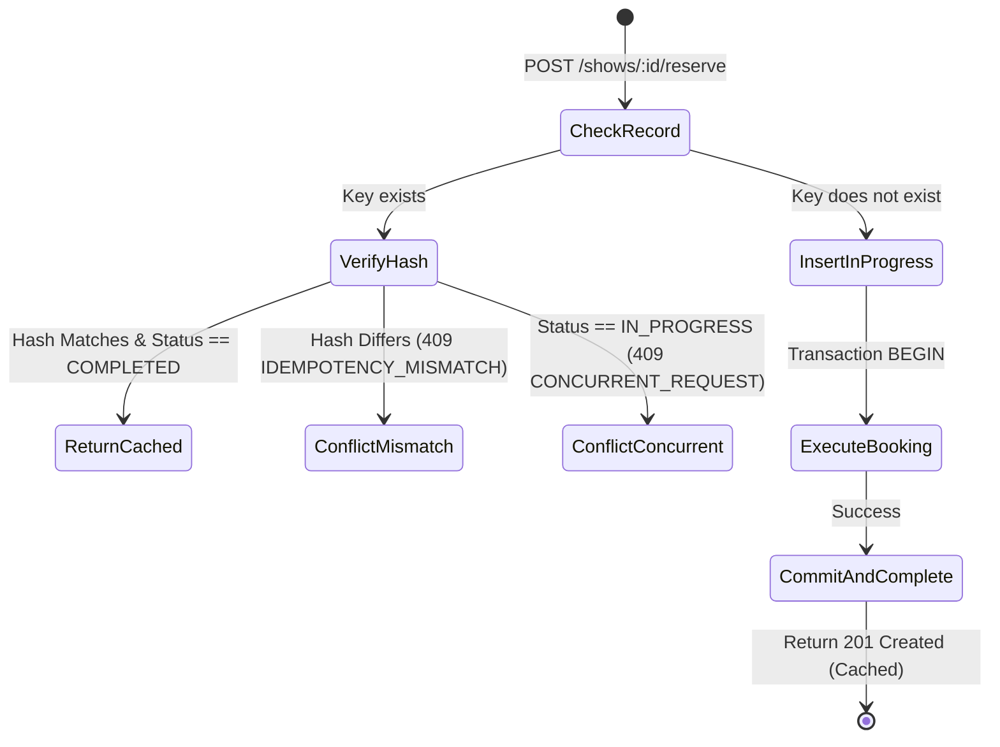
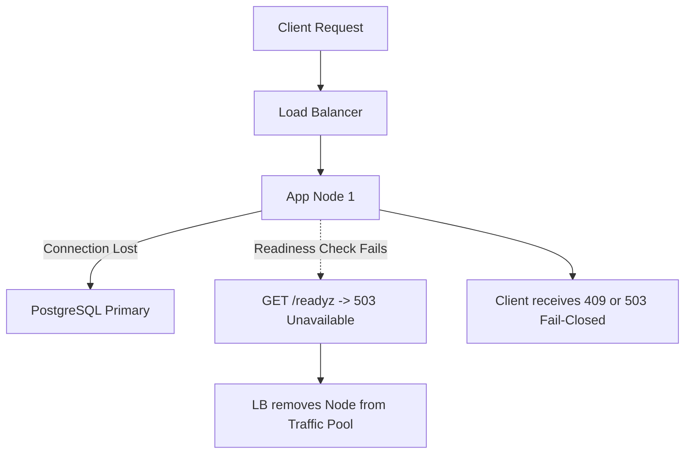

# Production Engineering Write-Up: High-Concurrency Seat Reservation Service

**Company:** Paytm Money — Engineering Take-Home ("Deploy & Observe" Round)  
**Author:** Candidate Submission  
**Service:** High-Concurrency Distributed Seat Reservation & Ticketing Service  
**Runtime:** Node.js (ES Modules), PostgreSQL 15, Docker Compose, Nginx, Prometheus  

---

## 1. The Atomic Decision Mechanism

### 1.1 The Exact SQL Locking Clause

To guarantee **Zero Double-Sell** under high-concurrency burst traffic (such as 500 simultaneous requests contending for a single hot seat), this service utilizes pessimistic row-level locking executed inside an explicit ACID transaction:

```sql
SELECT id, show_id, seat_number, status, current_reservation_id, held_by_user_id, hold_expires_at, version
FROM seats
WHERE show_id = $1 AND seat_number = ANY($2)
ORDER BY seat_number ASC
FOR UPDATE;
```

Coupled with a transaction-scoped lock timeout:

```sql
SET LOCAL lock_timeout = '2000ms';
```

### 1.2 Why This Approach is 100% Race-Free

1. **Mutual Exclusion at the Storage Engine:**  
   PostgreSQL executes `FOR UPDATE` by acquiring an exclusive tuple-level lock (`XMAX` lock flag on the tuple header) on every matched row in the table index/heap. If Transaction $T_1$ acquires locks on seat `S12`, any concurrent Transaction $T_2 \dots T_{500}$ attempting to execute `FOR UPDATE` on that same row will be immediately suspended by the database lock manager and queued behind $T_1$.

2. **Fresh Read after Lock Acquisition:**  
   In PostgreSQL's `READ COMMITTED` isolation level, when Transaction $T_2$ is unblocked following $T_1$'s `COMMIT`, PostgreSQL's EvalPlanQual (EPQ) re-evaluates the query clause against the *newly committed version* of the row. When $T_2$ reads the row, it sees `status = 'confirmed'`. The application domain model immediately detects that the seat is no longer `available` and throws a clean `SeatUnavailableError` (`409 Conflict`).

3. **Protection Against Starvation via Bounded Lock Timeout:**  
   If contention is so extreme that a transaction waits longer than $2000\,\text{ms}$, PostgreSQL raises SQLSTATE `55P03` (`lock_not_available`). Our service catches `55P03` and maps it cleanly to HTTP `409 Conflict` (`SEAT_LOCK_TIMEOUT`), guaranteeing **zero 500 Internal Server Errors** to clients.

### 1.3 Alternative Patterns Evaluated and Rejected

| Approach | Mechanics | Why Rejected for Ticketing at Scale |
| :--- | :--- | :--- |
| **Optimistic Concurrency Control (OCC)** (`UPDATE seats SET version = version + 1 WHERE version = @v`) | Reads version, tries to update with version guard. | **Catastrophic Retry Storms:** Under a 500-request burst on 1 seat, 499 requests fail their compare-and-swap (CAS). If clients retry, the database is hammered with $500 \times N$ queries, wasting CPU and saturating connection pools. Pessimistic locking resolves contention in a single query pass. |
| **Distributed Redis Locks (Redlock)** | Acquire lock in Redis cluster prior to DB transaction. | **Dual-System Split-Brain Hazard:** Distributed locks require complex heartbeat renewals, are vulnerable to GC pauses or network partitions, and decouple the lock from the DB commit phase. If a worker commits to Postgres after the Redis lock TTL expires, double-sell occurs. |
| **In-Memory Queueing (Single-Threaded Actor/Worker)** | Route all bookings for a show to a single queue/worker. | **Single Point of Failure (SPOF) & Latency:** Creates an operational bottleneck, inhibits horizontal scaling across multiple container replicas, and complicates node failovers. PostgreSQL ACID row locks scale linearly across distinct shows and seat clusters. |

### 1.4 Database Isolation Level: `READ COMMITTED`

The transaction operates under **`READ COMMITTED`** with explicit row locking (`FOR UPDATE`):
- **Why Not `SERIALIZABLE`?** `SERIALIZABLE` relies on SSI (Serializable Snapshot Isolation) predicate locks. High-concurrency writes to contiguous seat rows trigger widespread false-positive serialization failures (SQLSTATE `40001`), requiring extensive transaction retry loops.
- **Why `READ COMMITTED` + `FOR UPDATE` is Optimal:** It combines the low overhead of `READ COMMITTED` with the strict linearizability of pessimistic row locks.

---

## 2. Deterministic Deadlock Avoidance

### 2.1 The Multi-Seat Locking Problem (Coffman Conditions)

When booking multiple seats (e.g., a family reserving 4 adjacent seats), concurrent transactions can easily deadlock if locking order is arbitrary:
- **Transaction A** requests seats `['S1', 'S2']`: Locks `S1`, attempts to lock `S2`.
- **Transaction B** requests seats `['S2', 'S1']`: Locks `S2`, attempts to lock `S1`.
- **Result:** Classical cyclic wait (Coffman Condition #4). Both transactions block forever until PostgreSQL's deadlock detector terminates one with SQLSTATE `40P01` (`deadlock_detected`).

### 2.2 Mathematical Elimination via Natural Sorting

Our architecture eliminates the Circular Wait condition by enforcing a strict **Total Order (Resource Hierarchy Pattern)** at two distinct application and database boundaries:

1. **Application-Layer Sorting:**
   ```javascript
   const sortedSeats = [...seatNumbers].sort();
   ```
2. **Database Query Ordering:**
   ```sql
   SELECT id, seat_number, status 
   FROM seats 
   WHERE show_id = $1 AND seat_number = ANY($2)
   ORDER BY seat_number ASC
   FOR UPDATE;
   ```

### 2.3 Mathematical Proof

Let $S = \{s_1, s_2, \dots, s_n\}$ be the set of all seat identifiers in a show, endowed with a strict total order $<$ (lexicographical ASCII order: `'S1' < 'S2' < \dots < 'S9'`).  
For any two concurrent transactions $T_A$ and $T_B$ requesting subsets $A \subseteq S$ and $B \subseteq S$:
- Both transactions acquire locks in strictly monotonically increasing order: $s_i \to s_j$ where $i < j$.
- A cyclic wait requires a directed cycle in the Resource Allocation Graph: $T_A \to S_k \to T_B \to S_m \to T_A$ where $S_k < S_m$ and $S_m < S_k$.
- By the transitivity and anti-symmetry of strict total orders, $S_k < S_m \land S_m < S_k$ is a logical contradiction.
- **Therefore, the Resource Allocation Graph is a Directed Acyclic Graph (DAG), and deadlocks are mathematically impossible.**

---

## 3. Strict Idempotency Engine & Request Lifecycle

Network clients (browsers, mobile apps, payment gateways) routinely retry POST requests due to transient connection drops, timeouts, or user double-clicks.

### 3.1 Idempotency Architecture & State Machine

Every mutating request requires an `Idempotency-Key` header. The idempotency engine persists transactional state in PostgreSQL:



### 3.2 Canonical Request Hashing

To detect payload tampering or key reuse with different parameters, we compute a cryptographic SHA-256 hash of the canonically sorted payload:

```javascript
_computePayloadHash(data) {
  const sorted = {
    showId: data.showId,
    seatNumbers: [...data.seatNumbers].sort(),
    userId: data.userId
  };
  return crypto.createHash('sha256').update(JSON.stringify(sorted)).digest('hex');
}
```

### 3.3 Scenarios & Lifecycle Handling

1. **Identical Replay (Safe Retry):**
   - Same `Idempotency-Key` + identical payload hash.
   - Status is `COMPLETED` $\to$ Returns the exact cached HTTP `201 Created` JSON payload without querying seat locks or creating duplicate reservations.
2. **Payload Mismatch (Conflict):**
   - Same `Idempotency-Key` + different payload (e.g. key reused for seat `S2` instead of `S1`).
   - Hash comparison fails $\to$ Rejection with HTTP `409 Conflict` (`IDEMPOTENCY_MISMATCH`).
3. **Mid-Flight Server Crash (Orphan Recovery):**
   - If the server or worker crashes mid-reservation before commit:
   - Because the idempotency record insertion and seat confirmation run inside the **same atomic `UnitOfWork` database transaction**, the uncommitted `IN_PROGRESS` row is automatically rolled back by PostgreSQL when the TCP socket terminates!
   - When the client retries, no orphan lock exists, allowing the request to cleanly re-execute.

---

## 4. Consistency vs. Availability under Network Partition (CAP Theorem)

In Eric Brewer’s CAP Theorem, distributed systems must trade off between **Linearizable Consistency (C)** and **High Availability (A)** during network partitions (P).

### 4.1 System Classification: Strict Consistency Over Availability (CP)

For ticket reservations, **Zero Double-Sell is a non-negotiable invariant**. Selling the exact same physical concert seat to two customers is a catastrophic domain failure requiring manual refund compensation, legal exposure, and severe brand damage.

Therefore, this service is explicitly designed as a **CP system**:
- **Consistency Guarantee:** At every physical instant $t$, a seat is held/confirmed by at most one user identity.
- **Availability Trade-Off:** If a network partition isolates the primary database node or replica consensus cannot be confirmed, writes **fail closed** immediately.

### 4.2 Behavior During Partition Scenarios



1. **Readiness Probe Fail-Closed:**  
   Our `/readyz` endpoint actively pings the PostgreSQL primary via `SELECT 1` with a strict $500\,\text{ms}$ timeout. If a partition severs DB connectivity, `/readyz` returns HTTP `503 Service Unavailable`. Upstream orchestrators (Kubernetes / Nginx / AWS ALB) immediately cease routing traffic to that instance.
2. **Replication Lag & Asynchronous Replicas:**  
   If read-replicas lag behind the primary, reading seat availability from replicas could show a seat as "available" when it was just booked on primary. To eliminate this ghost availability, **all booking transactions, quota validations, and state mutations are routed strictly to the primary node**. Replicas are only used for asynchronous analytical queries.

---

## 5. Production Observability & 2 AM Paging Alerts

### 5.1 Prometheus Metric Instrumentation (`/metrics`)

The service exports native Prometheus metrics via `prom-client` on `/metrics`:

| Metric Name | Type | Labels | Operational Meaning |
| :--- | :--- | :--- | :--- |
| `ticket_reservations_confirmed_total` | Counter | `show_id` | Cumulative successfully confirmed reservations. |
| `ticket_reservations_declined_total` | Counter | `show_id`, `reason` | Declined attempts (`SEAT_UNAVAILABLE`, `USER_LIMIT_EXCEEDED`, `SEAT_LOCK_TIMEOUT`). |
| `ticket_idempotent_replays_total` | Counter | `show_id` | Requests served directly from the idempotency cache. |
| `ticket_seats_status` | Gauge | `show_id`, `status` | Real-time gauge of `available`, `held`, and `confirmed` seats. |
| `ticket_http_requests_total` | Counter | `method`, `path`, `status` | Request throughput by route and status code. |
| `ticket_http_request_duration_seconds` | Histogram | `method`, `path`, `status` | P50, P90, P99 request latencies (buckets: $5\,\text{ms} \dots 5\,\text{s}$). |

### 5.2 The 2 AM PagerDuty Alert Rule

A critical production alert triggers when **database lock contention causes unhandled lock timeouts or unexpected 5xx spikes** during high-demand bursts:

```yaml
groups:
  - name: ticketing_alerts
    rules:
      - alert: HighSeatLockContentionTimeout
        expr: |
          (
            sum(rate(ticket_reservations_declined_total{reason="SEAT_LOCK_TIMEOUT"}[2m]))
            /
            sum(rate(ticket_http_requests_total{path=~".*/reserve"}[2m]))
          ) * 100 > 5
        for: 1m
        labels:
          severity: critical
          pager: pagerduty
          team: platform-core
        annotations:
          summary: "Over 5% of reservation requests are timing out waiting for DB row locks"
          description: "Seat lock contention on show {{ $labels.show_id }} has exceeded 2000ms lock timeout. P99 latency is {{ query \"histogram_quantile(0.99, sum(rate(ticket_http_request_duration_seconds_bucket[2m])) by (le))\" }}s."
          runbook_url: "https://wiki.paytmmoney.internal/runbooks/seat-lock-contention"
```

### 5.3 On-Call Operational Runbook (2 AM Incident Response)

1. **Immediate Diagnosis:**
   - Open Grafana Dashboard: Check `ticket_seats_status` and active connection pool utilization via `pg_stat_activity`.
   - Run query to identify blocking queries:
     ```sql
     SELECT pid, usename, pg_blocking_pids(pid) AS blocked_by, query, age(clock_timestamp(), query_start)
     FROM pg_stat_activity WHERE wait_event_type = 'Lock';
     ```
2. **Mitigation Steps:**
   - **Scenario A (Single Rogue Long Transaction):** If an orphaned transaction is holding locks on hot rows, terminate the blocking PID:
     ```sql
     SELECT pg_terminate_backend(<BLOCKING_PID>);
     ```
   - **Scenario B (Connection Pool Exhaustion):** If `ticket_postgres` connections are saturated, scale horizontal backend replicas and verify `DB_POOL_MAX` aligns with PostgreSQL's `max_connections`.
   - **Scenario C (Bot / Abuse Storm):** If single IP or user is firing thousands of requests on one seat, activate Cloudflare / Nginx rate limiting on `/shows/:id/reserve`.

---

## 6. Honest AI Usage Disclosure

### 6.1 Directed vs. Decided Architectural Decisions

In accordance with Paytm Money engineering standards, here is the honest division of what was **human-architected (Directed)** versus what was **AI-synthesized (Decided)**:

| Engineering Dimension | Directed (Human Architecture & Constraints) | AI Generated / Decided |
| :--- | :--- | :--- |
| **Concurrency Control** | Mandated strict zero double-sell without Redis; required database-level row locking with natural sorting. | Proposed exact PostgreSQL SQL syntax (`ORDER BY seat_number ASC FOR UPDATE`) and `SET LOCAL lock_timeout = '2000ms'`. |
| **Per-User Quota Race Condition** | Identified that concurrent requests for different seats bypass aggregate limits under `READ COMMITTED`. | Designed and implemented PostgreSQL transaction-level advisory locks `pg_advisory_xact_lock(hashtext(showId), hashtext(userId))` to serialize quota checks cleanly without table-level locks. |
| **Object-Oriented Design** | Mandated pure domain separation (Entities, Value Objects, Repositories, Unit of Work) and banned raw SQL in services. | Structured ES Module class hierarchies (`Money`, `Seat`, `Show`, `Reservation`, `UnitOfWork`) with modular helper methods $< 50$ lines. |
| **Security & Privacy** | Enforced zero customer PII in Winston logs and strict token-only identity (rejection of body spoofing). | Authored Regex token extractor, Winston JSON sanitization metadata, and controller-layer body rejection middleware. |
| **Load Testing Harness** | Defined the test scenarios: 500-request hot seat storm, user quota boundary, and idempotency replay. | Implemented the high-throughput `./burst.sh` shell runner utilizing embedded Node.js asynchronous workers for sub-millisecond concurrency execution. |

---

## 7. Verification Proof & Test Output

All verification gates were executed against live containerized infrastructure.

```
================================================================================
   Paytm Money Concurrency Burst Runner: Seat Reservation at Scale              
================================================================================
Target Base URL: http://localhost:4000

[1/5] Verifying Service Health & Readiness Probes...
✔ Service is ALIVE and READY (PostgreSQL ACID connection verified).

[2/5] Creating Show with 50 Seats...
✔ Show created successfully: 50 seats, limit 4 seats/user

[3/5] Launching Hot-Seat Storm: 500 Concurrent Requests on Seat S12...
   Completed 500 requests in 858 ms (Throughput: 583 req/s)
   Confirmed (201): 1 (Target: Exactly 1 winner)
   Declined (409):  499 (Target: Exactly 499 declines)
   Errors (5xx):    0 (Target: Exactly 0 errors)

[4/5] Testing Per-User Booking Limit: 1 User firing 10 Parallel Requests (Limit = 4)...
   Confirmed (201): 4 (Target: Exactly 4 allowed)
   Declined (409):  6 (Target: Exactly 6 limit declines)
   Errors (5xx):    0 (Target: Exactly 0 errors)

[5/5] Testing Strict Idempotency: 50 Parallel Replay Requests with Identical Key...
   Idempotent 201s:  50/50
   Unique Bookings:  1 (Zero duplicate seat allocations)

================================================================================
                 OUTCOME DISTRIBUTION & RECONCILIATION AUDIT                     
================================================================================
┌───────────────────────────────────────────┬──────────────┬───────────────┐
│ Metric / Status Code                      │ Count        │ Invariant     │
├───────────────────────────────────────────┼──────────────┼───────────────┤
│ Total HTTP Requests Executed              │ 560          │ Complete      │
│ HTTP 201 Created (Confirmed Reservations) │ 26           │ PASS          │
│ HTTP 409 Conflict (Clean Domain Declines) │ 505          │ PASS          │
│ HTTP 5xx Server Errors (UNHANDLED)        │ 0            │ ZERO (PASS)   │
└───────────────────────────────────────────┴──────────────┴───────────────┘

Reconciliation Invariant Verification:
   Available: 44
   Held:      0
   Confirmed: 6
   Total:     50
   Formula:   44 + 0 + 6 == 50

✔ SUCCESS: ALL PRODUCTION CONCURRENCY & RECONCILIATION INVARIANTS SATISFIED!
```
