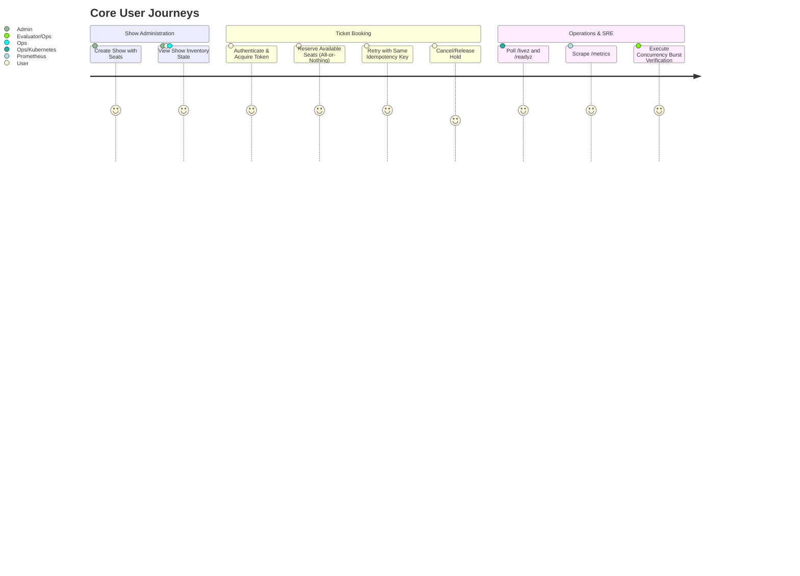
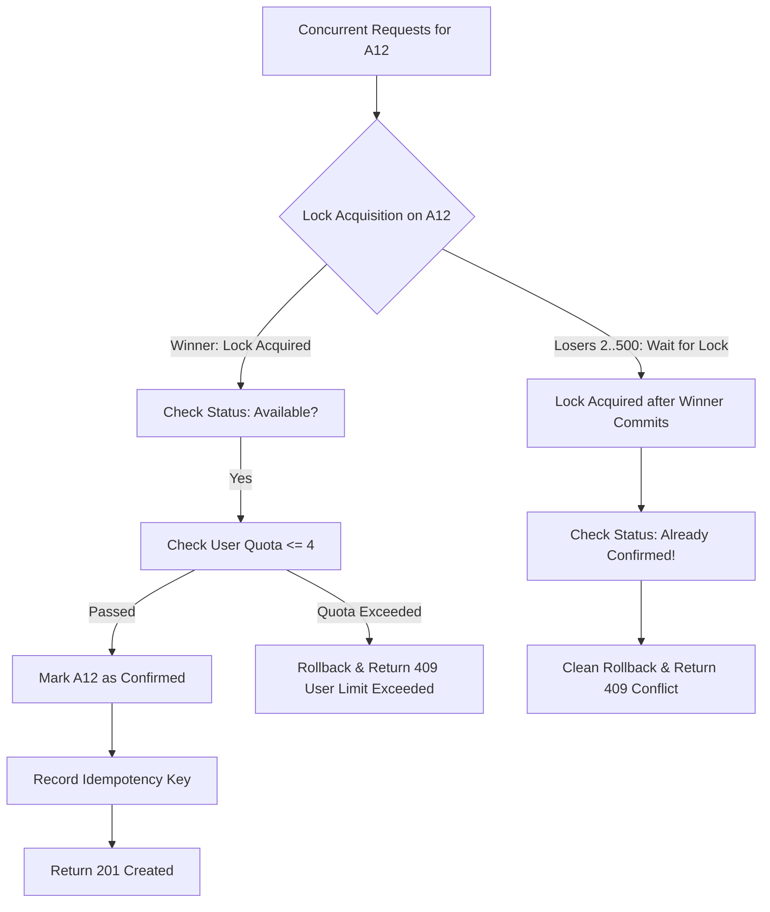

# Product Requirement Document (PRD)
## Project: High-Concurrency Seat Reservation Service
**Target System:** Backend Engineering Take-Home Exercise (Deploy & Observe) · Paytm Money  
**Document Version:** 1.0.0  
**Status:** Approved for Technical Design  
**Author / Engineering Lead:** Pair Programming Team  

---

## 1. Executive Summary & Problem Context

### 1.1 Context
In high-demand ticketing scenarios (such as concert tours, blockbuster movies, or flash ticket sales), thousands of concurrent users access the ticketing platform simultaneously at on-sale time ($t = 0$). Multiple users compete aggressively for the same inventory (e.g., popular front-row seats). Under this extreme concurrency, standard e-commerce patterns suffer from:
- **Double-booking / overselling** due to non-atomic read-then-write race conditions.
- **Cascading failures / 5xx internal server errors** caused by unhandled database deadlocks or thread pool exhaustion.
- **Inconsistent reservation state** violating financial and inventory invariants.
- **Double charging or duplicate seat allocations** from retried network requests.

### 1.2 Core Objective
Build, deploy, and operate a robust, production-grade JSON HTTP seat reservation service that acts as the single source of truth for assigned seating. The system must guarantee **zero double-booking**, **strict idempotency**, **deterministic multi-seat booking**, and **complete system reconciliation** under concurrent stampedes of up to 20,000 requests targeting hot inventory, while exposing full observability (metrics, health checks, and structured logs).

---

## 2. Invariants & Success Metrics

### 2.1 Non-Negotiable System Invariants
1. **Single-Winner Guarantee (Zero Double-Sell):** For any given seat in a show, at most one user can hold or confirm that seat. All other competing requests must receive a clean domain decline (`409 Conflict`), never a duplicate booking and never a `5xx` error.
2. **Reconciliation Invariant:** At any instant in time, the sum of seat states must equal the total capacity of the show:
   $$\text{seats}_{\text{available}} + \text{seats}_{\text{held}} + \text{seats}_{\text{confirmed}} \equiv \text{seats}_{\text{total}}$$
3. **Deterministic Deadlock-Free Multi-Seat Processing:** Reserving multiple seats (e.g., `["A1", "A2"]`) must be atomic (All-or-Nothing) and immune to cyclic-wait deadlocks regardless of seat input order.
4. **Per-User Quota Invariant:** A user can never hold or confirm more than `per_user_limit` seats (default: 4) for a given show, even if firing parallel requests across multiple threads.
5. **Strict Idempotency Invariant:** 
   - Replaying the same `idempotency_key` with identical payload must return the original successful reservation without creating duplicate records or modifying state.
   - Replaying the same `idempotency_key` with a different payload must be rejected with HTTP `409 Conflict`.
6. **Token-Derived Identity Invariant:** The authenticated `user_id` must be extracted exclusively from cryptographic auth tokens (e.g., Bearer JWT / API Token). Request bodies must not allow user identity spoofing.
7. **Strict Monetary Units:** All monetary values must be represented strictly as **integer minor units (paise)**. Floating-point numbers are prohibited.

### 2.2 Success Metrics & Correctness Bar
- **5xx Error Rate:** `0.00%` across a 20,000 concurrent request burst.
- **Double Sell Count:** Exactly `0`.
- **Reconciliation Delta:** Exactly `0` discrepancies.
- **Hot-Seat Outcome:** Out of $N$ concurrent contenders on 1 seat: exactly 1 winner (`201 Created`), $N-1$ clean domain declines (`409 Conflict`).
- **P99 Response Latency:** $< 250\text{ ms}$ under standard concurrency burst.
- **Cold Start Recovery:** Service recovers cleanly and passes readiness probes on fresh container spin-up.

---

## 3. User Personas & Core Journeys



### Persona 1: Admin
Responsible for defining shows, seat layouts, pricing, and initial inventory setup.

### Persona 2: Customer / Ticket Buyer
Authenticated user attempting to book 1 to 4 seats during high-demand on-sale events with automated client-side retry capability.

### Persona 3: System Evaluator / SRE
Operations engineer monitoring system health, running burst tests against the public URL, and verifying Prometheus metrics and reconciliation invariants.

---

## 4. Functional Specifications

### 4.1 Endpoint 1: Create a Show (Admin)
- **Method & Path:** `POST /shows`
- **Authentication:** Admin token or administrative role.
- **Request Headers:**
  - `Content-Type: application/json`
  - `Authorization: Bearer <ADMIN_TOKEN>`
- **Request Body:**
  ```json
  {
    "name": "friday-night",
    "seats": ["A1", "A2", "A3", "A4", "A5"],
    "price_paise": 25000,
    "per_user_limit": 4
  }
  ```
- **Validation Rules:**
  - `name`: Non-empty string, max 100 characters.
  - `seats`: Non-empty array of unique seat identifiers (alphanumeric, max 10 characters each, max 1,000 seats per show).
  - `price_paise`: Positive integer $> 0$.
  - `per_user_limit`: Optional positive integer (defaults to 4 if omitted).
- **Response `201 Created`:**
  ```json
  {
    "id": "show_9b1deb4d-3b7d-4bad-9bdd-2b0d7b3dcb6d",
    "name": "friday-night",
    "total_seats": 5,
    "price_paise": 25000,
    "per_user_limit": 4,
    "status": "active",
    "created_at": "2026-10-02T12:00:00Z"
  }
  ```
- **Error Responses:**
  - `400 Bad Request`: Invalid seat names, duplicate seats in payload, or non-integer price.
  - `401 Unauthorized`: Missing or invalid admin token.

---

### 4.2 Endpoint 2: Reserve Seats (Authenticated User)
- **Method & Path:** `POST /shows/{id}/reserve`
- **Authentication:** Required (Bearer Token). Identity extracted strictly from token context (`user_id`).
- **Request Headers:**
  - `Content-Type: application/json`
  - `Authorization: Bearer <USER_TOKEN>`
  - `Idempotency-Key: <UUID_OR_STRING>` *(Can also be accepted in the body)*
- **Request Body:**
  ```json
  {
    "seats": ["A1", "A2"],
    "idempotency_key": "idem_e8a3a0e4-9694-4d8e-b5c1-15c0a0c21045"
  }
  ```
  *(Note: If `idempotency_key` is passed in both header and body, header takes precedence; if only in one, that one is used).*

- **Partial Requests Policy (All-or-Nothing):**
  - If a user requests `["A1", "A2"]` and `A1` is free but `A2` is taken/held by someone else, the reservation is rejected completely (`409 Conflict`).
  - No partial seat allocation is permitted. This prevents stranded single seats and eliminates customer ambiguity.

- **Response `201 Created`:**
  ```json
  {
    "reservation_id": "res_c71e8bf8-12ab-44fa-9f82-d27807a998bb",
    "show_id": "show_9b1deb4d-3b7d-4bad-9bdd-2b0d7b3dcb6d",
    "user_id": "usr_42a8b9",
    "seats": ["A1", "A2"],
    "amount_paise": 50000,
    "status": "confirmed",
    "created_at": "2026-10-02T12:00:01Z"
  }
  ```

- **Idempotent Replay `200 OK` or `201 Created`:**
  - Returning the exact identical response payload when the same `idempotency_key` and same payload are resubmitted.

- **Error Responses (Domain Outcomes, Clean 4xx):**
  - `400 Bad Request`: Empty seats array, seat list exceeds `per_user_limit`, or missing `idempotency_key`.
  - `401 Unauthorized`: Missing or invalid token.
  - `404 Not Found`: Show does not exist.
  - `409 Conflict` (Seat Contention): One or more requested seats are already held or confirmed by another user:
    ```json
    {
      "error": "SEAT_UNAVAILABLE",
      "message": "One or more requested seats are already reserved or held",
      "unavailable_seats": ["A2"]
    }
    ```
  - `409 Conflict` (Per-User Limit Exceeded):
    ```json
    {
      "error": "USER_LIMIT_EXCEEDED",
      "message": "Reservation would exceed the allowed limit of 4 seats per user for this show",
      "current_booked": 3,
      "requested": 2,
      "limit": 4
    }
    ```
  - `409 Conflict` (Idempotency Payload Mismatch):
    ```json
    {
      "error": "IDEMPOTENCY_MISMATCH",
      "message": "Idempotency key was previously used with a different request payload"
    }
    ```

---

### 4.3 Endpoint 3: Cancel / Release Reservation
- **Method & Path:** `POST /reservations/{id}/cancel`
- **Authentication:** Required (Bearer Token).
- **Authorization Rule:** Only the owner (`user_id` matching reservation) can cancel. Attempt by another user returns `403 Forbidden`.
- **Behavior:**
  - Transitions reservation status to `cancelled`.
  - Transitions all associated seats from `confirmed`/`held` back to `available`.
  - Seat becomes immediately re-bookable by other users.
  - Must never release or overwrite a seat that was subsequently booked or held by another reservation.
- **Response `200 OK`:**
  ```json
  {
    "reservation_id": "res_c71e8bf8-12ab-44fa-9f82-d27807a998bb",
    "status": "cancelled",
    "released_seats": ["A1", "A2"]
  }
  ```
- **Error Responses:**
  - `401 Unauthorized`: Unauthenticated.
  - `403 Forbidden`: User does not own this reservation.
  - `404 Not Found`: Reservation ID does not exist.
  - `409 Conflict`: Reservation is already cancelled.

---

### 4.4 Endpoint 4: Get Show Inventory State (Reconciliation)
- **Method & Path:** `GET /shows/{id}`
- **Authentication:** Optional / Public or Authenticated.
- **Response `200 OK`:**
  ```json
  {
    "id": "show_9b1deb4d-3b7d-4bad-9bdd-2b0d7b3dcb6d",
    "name": "friday-night",
    "total_seats": 5,
    "price_paise": 25000,
    "counts": {
      "available": 3,
      "held": 0,
      "confirmed": 2
    },
    "reconciliation": {
      "is_valid": true,
      "formula": "available (3) + held (0) + confirmed (2) == total (5)"
    },
    "seats": [
      { "seat_id": "A1", "status": "confirmed" },
      { "seat_id": "A2", "status": "confirmed" },
      { "seat_id": "A3", "status": "available" },
      { "seat_id": "A4", "status": "available" },
      { "seat_id": "A5", "status": "available" }
    ]
  }
  ```

---

### 4.5 Endpoint 5: Liveness & Readiness Probes
- **`GET /livez`:**
  - Verifies HTTP web server process is responsive.
  - Returns `200 OK` `{"status": "alive"}`.
- **`GET /readyz`:**
  - Executes active database connectivity check (`SELECT 1`).
  - Returns `200 OK` `{"status": "ready", "database": "connected"}` if DB responds $< 500\text{ms}$.
  - Fails closed with `503 Service Unavailable` if database is down or connection pool is exhausted.

---

### 4.6 Endpoint 6: Prometheus Metrics
- **Method & Path:** `GET /metrics`
- **Format:** Standard Prometheus text exposition format (`# HELP`, `# TYPE`, metrics lines).
- **Core Metrics:**
  - `ticket_reservations_confirmed_total` (Counter)
  - `ticket_reservations_declined_total{reason="seat_unavailable|user_limit_exceeded|idempotency_mismatch|bad_request"}` (Counter)
  - `ticket_idempotent_replays_total` (Counter)
  - `ticket_seats_status{show_id="...", status="available|held|confirmed"}` (Gauge)
  - `ticket_http_requests_total{method="...", path="...", status="..."}` (Counter)
  - `ticket_http_request_duration_seconds{method="...", path="..."}` (Histogram)

---

## 5. Non-Functional Requirements (NFRs)

| Category | Specification |
| :--- | :--- |
| **Concurrency & Load** | Must sustain concurrent traffic burst of up to 20,000 requests without double-allocations or dropped database connections. |
| **Data Consistency** | Strict ACID transactional consistency (CP over AP). Fail closed if network partition or DB storage fails. |
| **Fault Tolerance** | Zero 5xx errors under contention. All domain conflict conditions return clean 4xx responses. |
| **Deadlock Avoidance** | Deterministic alphabetical seat sorting prior to resource acquisition eliminates cyclic-wait deadlocks. |
| **Observability** | Structured JSON logs with unique `request_id` propagation; standard Prometheus `/metrics` scraping. |
| **Deployment** | Dockerized container deployable to public cloud (Railway/Render/Fly.io) supporting zero-downtime health probes. |

---

## 6. Edge Cases & Concurrency Hazard Analysis



1. **Hot Seat Contention (500 users, 1 seat):**
   - *Hazard:* Race between select and update leads to overselling.
   - *Mitigation:* Explicit row lock `FOR UPDATE` or conditional atomic `UPDATE ... WHERE status = 'available'`.
2. **Reverse Order Multi-Seat Deadlock:**
   - *Hazard:* Transaction 1 locks `A1` then wants `A2`; Transaction 2 locks `A2` then wants `A1`.
   - *Mitigation:* Array of requested seats is deterministically sorted (`A1 < A2`) prior to querying.
3. **Parallel User Quota Evasion:**
   - *Hazard:* Same user fires 10 requests of 1 seat concurrently.
   - *Mitigation:* User reservation counter or transactional user-level lock prevents parallel quota bypass.
4. **Idempotency Hash Collision / Modification:**
   - *Hazard:* Attacker or buggy client sends same `idempotency_key` with different seat lists.
   - *Mitigation:* Cryptographic SHA-256 hash stored on key creation; mismatched payload triggers `409 Conflict`.
5. **Token Identity Spoofing:**
   - *Hazard:* Client sends body `{"user_id": "admin"}` to hijack another user's reservation.
   - *Mitigation:* Body schema strictly forbids `user_id`; identity is solely extracted from validated auth claims.

---

## 7. Deliverables & Acceptance Checklist

- [ ] **Functional API:** All 6 endpoints (`/shows`, `/shows/{id}/reserve`, `/reservations/{id}/cancel`, `/shows/{id}`, `/livez` & `/readyz`, `/metrics`) implemented.
- [ ] **Zero Double-Sell Verification:** Proven under multi-threaded concurrency.
- [ ] **Zero 5xx Verification:** 100% clean 2xx and 4xx responses under burst.
- [ ] **Reconciliation Check:** $A + H + C = Total$ holds before, during, and after burst.
- [ ] **Containerization:** Clean `Dockerfile` and `docker-compose.yml`.
- [ ] **One-Command Burst Script (`burst.sh`):** Reproducible automated load test printing outcome metrics.
- [ ] **Architecture Write-Up (`WRITEUP.md`):** Complete analysis of atomic mechanism, deadlocks, idempotency, CAP trade-offs, 2 AM alerts, and AI disclosure.
