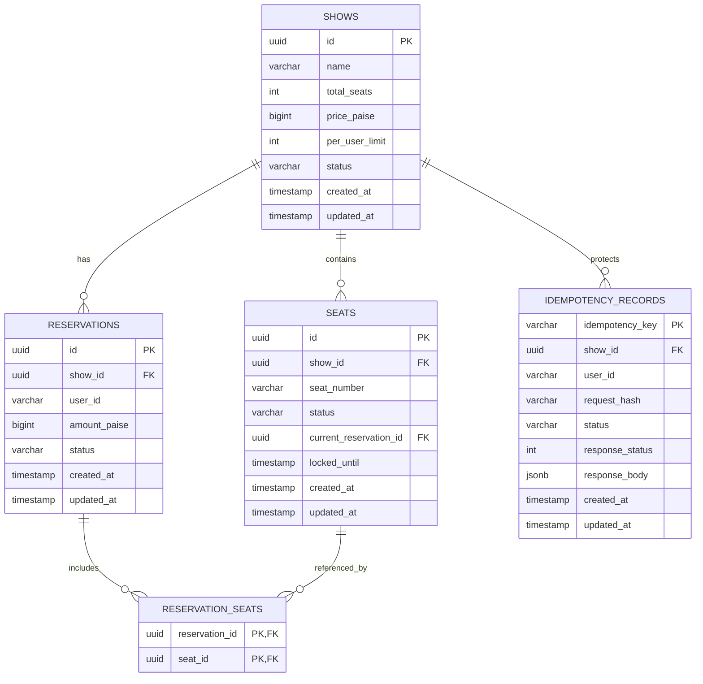
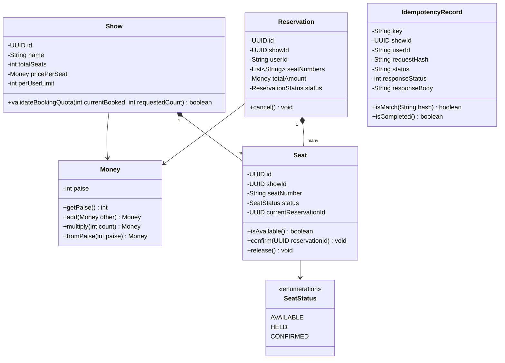
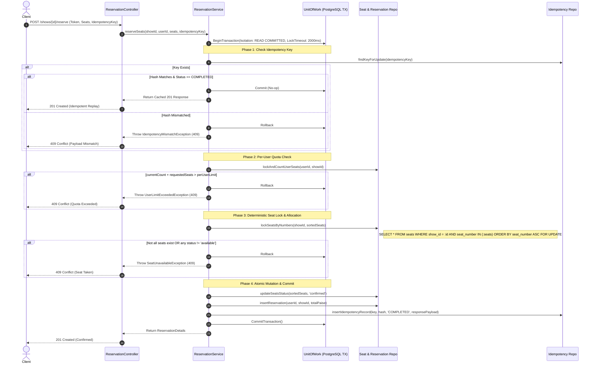

# Technical Requirement Document (TRD)
## Project: High-Concurrency Seat Reservation Service


---

## 1. System Architecture & Tech Stack Selection

### 1.1 Architecture Overview
The service is architected using **Clean Architecture / Hexagonal Architecture** principles, enforcing strict separation of concerns, dependency inversion, and domain purity. The core domain logic is decoupled from transport layers (HTTP/REST) and persistence mechanisms (PostgreSQL).

```
 ┌─────────────────────────────────────────────────────────────┐
 │                      HTTP / API Layer                       │
 │   Controllers | Routing | Middlewares (Auth, Metrics, Trace) │
 └──────────────────────────────┬──────────────────────────────┘
                                │
 ┌──────────────────────────────▼──────────────────────────────┐
 │                    Application Service Layer                │
 │    ReservationService | ShowService | ReconciliationService  │
 └──────────────────────────────┬──────────────────────────────┘
                                │
 ┌──────────────────────────────▼──────────────────────────────┐
 │                      Domain Model Layer                     │
 │   Entities (Show, Seat, Reservation) | Value Objects (Money)│
 │                State Machine | Domain Events                │
 └──────────────────────────────┬──────────────────────────────┘
                                │
 ┌──────────────────────────────▼──────────────────────────────┐
 │                  Infrastructure & Persistence               │
 │ UnitOfWork | Postgres Repositories | Prometheus | Logger    │
 └─────────────────────────────────────────────────────────────┘
```

### 1.2 Technology Stack Justification

| Component | Selected Technology | Technical Rationale |
| :--- | :--- | :--- |
| **Language & Runtime** | **Node.js (JavaScript / ES Modules)** | Non-blocking asynchronous I/O event loop, lightweight footprint, high throughput for I/O-bound concurrency bursts. |
| **HTTP Framework** | **Fastify (or Express)** | High-throughput request handling, low overhead, and robust middleware ecosystem. |
| **Primary Datastore** | **PostgreSQL 16+** | True ACID compliance, row-level locking (`SELECT ... FOR UPDATE`), partial indexes, and transactional DDL. Strictly aligns with Paytm requirement for a single datastore. |
| **Connection Pooling** | `pg` (`node-postgres` Pool) | Production-grade connection pooling (`pg.Pool`), transaction support, configurable pool size and connection timeouts. |
| **Observability** | `prom-client` | Official Prometheus client for Node.js, exposing standard metrics format on `/metrics`. |
| **Logging** | `winston` | Production-grade structured JSON logger with custom formatters, log levels, and request context/correlation ID tracing. |
| **Containerization** | Multi-stage Docker (Node.js Alpine) | Lightweight container (< 100MB) enabling rapid deployment and reliable cold starts on public cloud. |


---

## 2. Database Schema & Data Integrity Design

### 2.1 Database Entities & Relationships (ERD)



### 2.2 PostgreSQL DDL (Data Definition Language)

```sql
-- 1. Shows Table
CREATE TABLE shows (
    id UUID PRIMARY KEY DEFAULT gen_random_uuid(),
    name VARCHAR(100) NOT NULL,
    total_seats INT NOT NULL CHECK (total_seats > 0),
    price_paise BIGINT NOT NULL CHECK (price_paise > 0),
    per_user_limit INT NOT NULL DEFAULT 4 CHECK (per_user_limit > 0),
    status VARCHAR(20) NOT NULL DEFAULT 'active',
    created_at TIMESTAMPTZ NOT NULL DEFAULT NOW(),
    updated_at TIMESTAMPTZ NOT NULL DEFAULT NOW()
);

-- 2. Seats Table
CREATE TYPE seat_status AS ENUM ('available', 'held', 'confirmed');

CREATE TABLE seats (
    id UUID PRIMARY KEY DEFAULT gen_random_uuid(),
    show_id UUID NOT NULL REFERENCES shows(id) ON DELETE CASCADE,
    seat_number VARCHAR(20) NOT NULL,
    status seat_status NOT NULL DEFAULT 'available',
    current_reservation_id UUID,
    locked_until TIMESTAMPTZ,
    version INT NOT NULL DEFAULT 1,
    created_at TIMESTAMPTZ NOT NULL DEFAULT NOW(),
    updated_at TIMESTAMPTZ NOT NULL DEFAULT NOW(),
    CONSTRAINT uq_show_seat_number UNIQUE (show_id, seat_number)
);

CREATE INDEX idx_seats_show_status ON seats(show_id, status);
CREATE INDEX idx_seats_show_number ON seats(show_id, seat_number);

-- 3. Reservations Table
CREATE TYPE reservation_status AS ENUM ('pending', 'confirmed', 'cancelled');

CREATE TABLE reservations (
    id UUID PRIMARY KEY DEFAULT gen_random_uuid(),
    show_id UUID NOT NULL REFERENCES shows(id) ON DELETE RESTRICT,
    user_id VARCHAR(64) NOT NULL,
    amount_paise BIGINT NOT NULL CHECK (amount_paise >= 0),
    status reservation_status NOT NULL DEFAULT 'confirmed',
    created_at TIMESTAMPTZ NOT NULL DEFAULT NOW(),
    updated_at TIMESTAMPTZ NOT NULL DEFAULT NOW()
);

CREATE INDEX idx_reservations_user_show ON reservations(user_id, show_id, status);

-- 4. Reservation Seats (Join Table)
CREATE TABLE reservation_seats (
    reservation_id UUID NOT NULL REFERENCES reservations(id) ON DELETE CASCADE,
    seat_id UUID NOT NULL REFERENCES seats(id) ON DELETE RESTRICT,
    PRIMARY KEY (reservation_id, seat_id)
);

-- 5. Idempotency Records Table
CREATE TABLE idempotency_records (
    idempotency_key VARCHAR(128) PRIMARY KEY,
    show_id UUID NOT NULL REFERENCES shows(id) ON DELETE CASCADE,
    user_id VARCHAR(64) NOT NULL,
    request_hash VARCHAR(64) NOT NULL,
    status VARCHAR(20) NOT NULL, -- 'IN_PROGRESS', 'COMPLETED'
    response_status INT,
    response_body JSONB,
    created_at TIMESTAMPTZ NOT NULL DEFAULT NOW(),
    updated_at TIMESTAMPTZ NOT NULL DEFAULT NOW()
);

CREATE INDEX idx_idempotency_show_user ON idempotency_records(show_id, user_id);
```

---

## 3. Object-Oriented Design & Design Patterns

### 3.1 Class Diagram & Domain Entities



### 3.2 Design Patterns & Engineering Justification

#### 1. Repository Pattern (`IShowRepository`, `ISeatRepository`, `IReservationRepository`)
* **Rationale:** Decouples core domain business rules from specific PostgreSQL queries and ORM frameworks. Enables unit testing using mock in-memory stores without requiring a running database.

#### 2. Unit of Work & Transaction Manager Pattern (`IUnitOfWork`, `ITransactionContext`)
* **Rationale:** The entire reservation sequence—locking seats, validating quota, inserting reservation, mapping seats, and saving idempotency record—must execute in a single ACID transaction. The `UnitOfWork` guarantees either all modifications commit or everything cleanly rolls back with zero orphan state.

#### 3. Pessimistic Locking with Deterministic Ordering (Resource Hierarchy Pattern)
* **Rationale:** Eliminates the Coffman "Circular Wait" condition for multi-seat bookings. By enforcing a strict natural sort order on seat identifiers (`ORDER BY seat_number ASC`) prior to lock acquisition, two concurrent transactions will never dead-lock each other.

#### 4. Idempotent Receiver Pattern (`IdempotencyService`)
* **Rationale:** Guarantees network retries are harmless. By storing a cryptographic SHA-256 hash of the canonical request body, we distinguish between safe replays (same key, same payload) and fraudulent/conflicting replays (same key, modified payload).

#### 5. State Pattern / State Machine (`SeatStateMachine`)
* **Rationale:** Explicit finite state transitions ensure that seats can only transition through authorized pathways (`available` $\rightarrow$ `confirmed`, `confirmed` $\rightarrow$ `available`). Invalid transitions are blocked at the domain model level.

#### 6. Value Object Pattern (`Money`)
* **Rationale:** Enforces integer paise arithmetic globally. Disallows floating-point numbers at compile-time and guarantees immutability.

---

## 4. The Concurrency Control & Atomic Reservation Algorithm

### 4.1 Step-by-Step Transaction Execution Flow



### 4.2 SQL Isolation & Timeout Policy
* **Transaction Isolation Level:** `READ COMMITTED`.
  * *Why not SERIALIZABLE?* `SERIALIZABLE` relies on optimistic concurrency and triggers frequent serialization failures (`40001`) under 20,000 request bursts, forcing high retry thrashing. `READ COMMITTED` paired with explicit deterministic `SELECT ... FOR UPDATE` row-level locks provides strict linearizability for hot rows without serialization churn.
* **Lock Timeout:**
  ```sql
  SET LOCAL lock_timeout = '2000ms';
  ```
  If extreme lock queue depth prevents acquiring a seat row lock within 2.0 seconds, PostgreSQL cleanly aborts with code `55P03`. The application catches `55P03` and maps it directly to `409 Conflict` ("Seat contention timeout"), completely avoiding server thread exhaustion and `5xx` errors.

---

## 5. Security & Authentication Specification

### 5.1 Token Verification Architecture
* **Auth Protocol:** Bearer Token (HMAC-SHA256 JWT or validated opaque token).
* **Claims Structure:**
  ```json
  {
    "sub": "usr_998811",
    "role": "user",
    "iat": 1727870400,
    "exp": 1727956800
  }
  ```
* **Security Rules:**
  1. `user_id` is extracted purely from token claims (`sub`).
  2. Request body has **zero** `user_id` field. Any client attempt to inject `user_id` into the JSON payload is stripped or causes validation failure.
  3. Only the authenticated token owner (`user_id == reservation.user_id`) or an `admin` role can invoke cancellation on `POST /reservations/{id}/cancel`. Mismatched callers receive `403 Forbidden`.

---

## 6. Observability & SRE Specifications

### 6.1 Prometheus Metrics Schema
| Metric Name | Type | Labels | Description |
| :--- | :--- | :--- | :--- |
| `ticket_reservations_confirmed_total` | Counter | `show_id` | Count of successfully booked reservations. |
| `ticket_reservations_declined_total` | Counter | `show_id`, `reason` | Count of declined reservations (`seat_taken`, `user_limit_exceeded`, `idempotency_mismatch`, `bad_request`). |
| `ticket_idempotent_replays_total` | Counter | `show_id` | Count of identical requests fulfilled via idempotency cache. |
| `ticket_seats_status` | Gauge | `show_id`, `status` | Current count of seats by status (`available`, `held`, `confirmed`). |
| `ticket_http_request_duration_seconds`| Histogram | `method`, `path`, `status` | Response latency distribution. |

### 6.2 Health & Readiness Probes
* `GET /livez`:
  - Returns `200 OK` `{"status": "alive"}` immediately.
* `GET /readyz`:
  - Executes `SELECT 1` with a 500ms timeout on PostgreSQL.
  - If successful: returns `200 OK` `{"status": "ready", "database": "connected"}`.
  - If fails or times out: returns `503 Service Unavailable` `{"status": "not_ready", "error": "db_unreachable"}`.

### 6.3 Structured Logging Spec
Every request logs a canonical JSON event:
```json
{
  "timestamp": "2026-10-02T12:00:00.123Z",
  "level": "info",
  "request_id": "c1f7a18e-4a60-4960-994c-e87fbebc5f77",
  "method": "POST",
  "path": "/shows/123/reserve",
  "user_id": "usr_998811",
  "status_code": 201,
  "duration_ms": 12.4,
  "action": "RESERVATION_CONFIRMED",
  "seats": ["A1", "A2"]
}
```

---

## 7. Phase-Wise Development & Testing Roadmap

To ensure zero regressions and high architectural stability, development proceeds through distinct incremental phases:

```mermaid
gantt
    title Phase-Wise Implementation Roadmap
    dateFormat  X
    axisFormat %d
    section Phase 1: Foundation
    Project Scaffolding & Config        :0, 1
    DB Schema, DDL & Migrations        :1, 2
    section Phase 2: Domain & Persistence
    Domain Entities & OOP Value Objects:2, 3
    UnitOfWork & Repository Layer      :3, 4
    section Phase 3: Business Logic
    Show & Seat Services               :4, 5
    Deterministic Locking Engine       :5, 6
    Idempotency & Quota Manager        :6, 7
    section Phase 4: API & Observability
    HTTP Handlers & Token Auth         :7, 8
    Metrics, Probes & Structured Logs  :8, 9
    section Phase 5: Containerization
    Dockerfile & Compose Orchestration :9, 10
    Cloud Deploy Setup                 :10, 11
    section Phase 6: Testing & Validation
    Unit & Concurrency Integration Tests:11, 12
    burst.sh Load Script & Verification:12, 13
    WRITEUP.md & Submission Prep       :13, 14
```



### Milestone Breakdown
- **Phase 1: Project Setup & Database Foundations**
  - Project module setup, folder structure (`cmd/`, `internal/domain`, `internal/service`, `internal/repo`, `internal/api`).
  - PostgreSQL migration scripts and connection pool configuration.
- **Phase 2: Core Domain Entities & OOP Design**
  - Implement Domain models (`Show`, `Seat`, `Reservation`, `Money`, `IdempotencyRecord`).
  - Implement interfaces for Repositories and UnitOfWork.
- **Phase 3: Core Engine & Concurrency Control**
  - Implement deterministic lock acquisition logic (`ORDER BY seat_number ASC FOR UPDATE`).
  - Implement Per-User quota enforcement and Idempotency hash verification.
  - Test transactional rollback and atomic state guarantees.
- **Phase 4: API, Middleware & Observability**
  - Implement HTTP controllers with input validation.
  - Implement Auth middleware and Correlation ID middleware.
  - Implement Prometheus metric collectors and `/livez` / `/readyz` probes.
- **Phase 5: Containerization & Cloud Deployment**
  - Multi-stage Dockerfile and `docker-compose.yml`.
  - Deployment configuration for public cloud host.
- **Phase 6: Testing, Burst Verification & Documentation**
  - Unit tests for domain logic and state transitions.
  - Concurrency integration tests simulating parallel lock contention.
  - `burst.sh` load benchmark harness.
  - `WRITEUP.md` addressing all 6 required interview topics.
