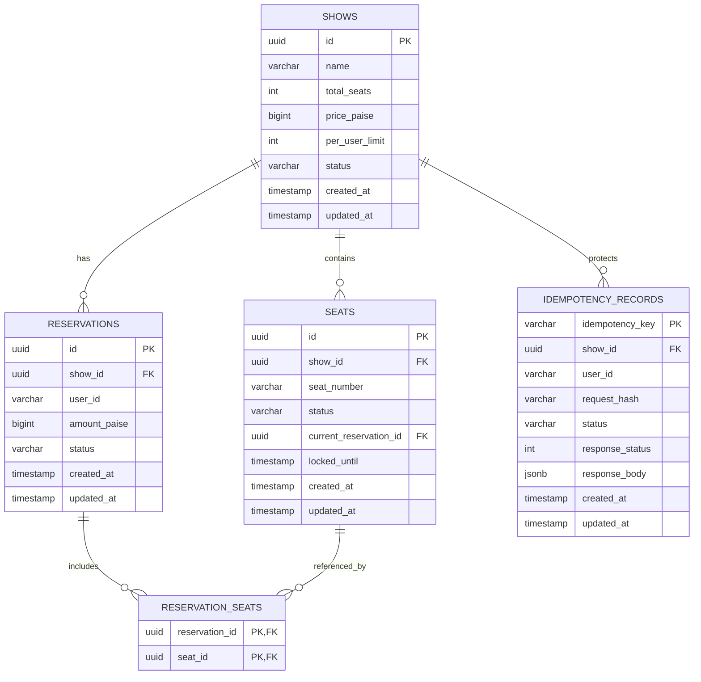
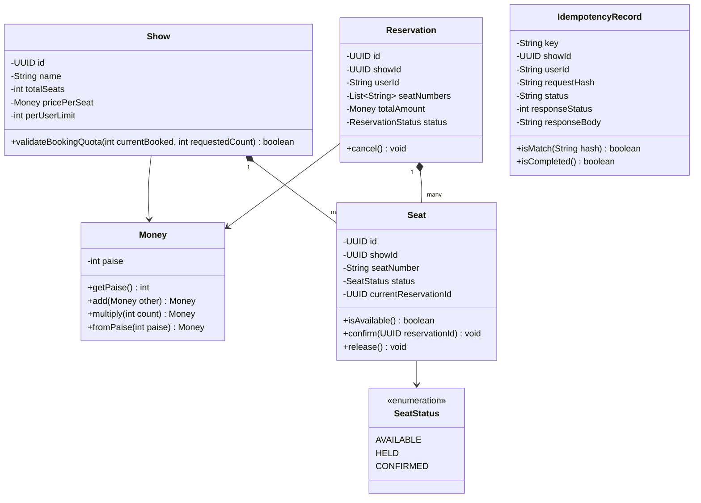
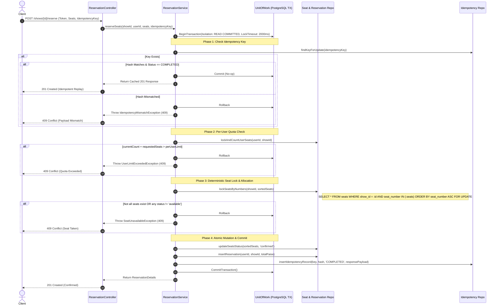

# Technical Requirement Document (TRD)
## Project: High-Concurrency Seat Reservation Service


---

## 1. System Architecture & Tech Stack Selection

### 1.1 Architecture Overview
The service is architected using **Clean Architecture / Hexagonal Architecture** principles, enforcing strict separation of concerns, dependency inversion, and domain purity. The core domain logic is decoupled from transport layers (HTTP/REST) and persistence mechanisms (PostgreSQL).

```
 ┌─────────────────────────────────────────────────────────────┐
 │                      HTTP / API Layer                       │
 │   Controllers | Routing | Middlewares (Auth, Metrics, Trace) │
 └──────────────────────────────┬──────────────────────────────┘
                                │
 ┌──────────────────────────────▼──────────────────────────────┐
 │                    Application Service Layer                │
 │    ReservationService | ShowService | ReconciliationService  │
 └──────────────────────────────┬──────────────────────────────┘
                                │
 ┌──────────────────────────────▼──────────────────────────────┐
 │                      Domain Model Layer                     │
 │   Entities (Show, Seat, Reservation) | Value Objects (Money)│
 │                State Machine | Domain Events                │
 └──────────────────────────────┬──────────────────────────────┘
                                │
 ┌──────────────────────────────▼──────────────────────────────┐
 │                  Infrastructure & Persistence               │
 │ UnitOfWork | Postgres Repositories | Prometheus | Logger    │
 └─────────────────────────────────────────────────────────────┘
```

### 1.2 Technology Stack Justification

| Component | Selected Technology | Technical Rationale |
| :--- | :--- | :--- |
| **Language & Runtime** | **Node.js (JavaScript / ES Modules)** | Non-blocking asynchronous I/O event loop, lightweight footprint, high throughput for I/O-bound concurrency bursts. |
| **HTTP Framework** | **Fastify (or Express)** | High-throughput request handling, low overhead, and robust middleware ecosystem. |
| **Primary Datastore** | **PostgreSQL 16+** | True ACID compliance, row-level locking (`SELECT ... FOR UPDATE`), partial indexes, and transactional DDL. Strictly aligns with Paytm requirement for a single datastore. |
| **Connection Pooling** | `pg` (`node-postgres` Pool) | Production-grade connection pooling (`pg.Pool`), transaction support, configurable pool size and connection timeouts. |
| **Observability** | `prom-client` | Official Prometheus client for Node.js, exposing standard metrics format on `/metrics`. |
| **Logging** | `winston` | Production-grade structured JSON logger with custom formatters, log levels, and request context/correlation ID tracing. |
| **Containerization** | Multi-stage Docker (Node.js Alpine) | Lightweight container (< 100MB) enabling rapid deployment and reliable cold starts on public cloud. |


---

## 2. Database Schema & Data Integrity Design

### 2.1 Database Entities & Relationships (ERD)



### 2.2 PostgreSQL DDL (Data Definition Language)

```sql
-- 1. Shows Table
CREATE TABLE shows (
    id UUID PRIMARY KEY DEFAULT gen_random_uuid(),
    name VARCHAR(100) NOT NULL,
    total_seats INT NOT NULL CHECK (total_seats > 0),
    price_paise BIGINT NOT NULL CHECK (price_paise > 0),
    per_user_limit INT NOT NULL DEFAULT 4 CHECK (per_user_limit > 0),
    status VARCHAR(20) NOT NULL DEFAULT 'active',
    created_at TIMESTAMPTZ NOT NULL DEFAULT NOW(),
    updated_at TIMESTAMPTZ NOT NULL DEFAULT NOW()
);

-- 2. Seats Table
CREATE TYPE seat_status AS ENUM ('available', 'held', 'confirmed');

CREATE TABLE seats (
    id UUID PRIMARY KEY DEFAULT gen_random_uuid(),
    show_id UUID NOT NULL REFERENCES shows(id) ON DELETE CASCADE,
    seat_number VARCHAR(20) NOT NULL,
    status seat_status NOT NULL DEFAULT 'available',
    current_reservation_id UUID,
    locked_until TIMESTAMPTZ,
    version INT NOT NULL DEFAULT 1,
    created_at TIMESTAMPTZ NOT NULL DEFAULT NOW(),
    updated_at TIMESTAMPTZ NOT NULL DEFAULT NOW(),
    CONSTRAINT uq_show_seat_number UNIQUE (show_id, seat_number)
);

CREATE INDEX idx_seats_show_status ON seats(show_id, status);
CREATE INDEX idx_seats_show_number ON seats(show_id, seat_number);

-- 3. Reservations Table
CREATE TYPE reservation_status AS ENUM ('pending', 'confirmed', 'cancelled');

CREATE TABLE reservations (
    id UUID PRIMARY KEY DEFAULT gen_random_uuid(),
    show_id UUID NOT NULL REFERENCES shows(id) ON DELETE RESTRICT,
    user_id VARCHAR(64) NOT NULL,
    amount_paise BIGINT NOT NULL CHECK (amount_paise >= 0),
    status reservation_status NOT NULL DEFAULT 'confirmed',
    created_at TIMESTAMPTZ NOT NULL DEFAULT NOW(),
    updated_at TIMESTAMPTZ NOT NULL DEFAULT NOW()
);

CREATE INDEX idx_reservations_user_show ON reservations(user_id, show_id, status);

-- 4. Reservation Seats (Join Table)
CREATE TABLE reservation_seats (
    reservation_id UUID NOT NULL REFERENCES reservations(id) ON DELETE CASCADE,
    seat_id UUID NOT NULL REFERENCES seats(id) ON DELETE RESTRICT,
    PRIMARY KEY (reservation_id, seat_id)
);

-- 5. Idempotency Records Table
CREATE TABLE idempotency_records (
    idempotency_key VARCHAR(128) PRIMARY KEY,
    show_id UUID NOT NULL REFERENCES shows(id) ON DELETE CASCADE,
    user_id VARCHAR(64) NOT NULL,
    request_hash VARCHAR(64) NOT NULL,
    status VARCHAR(20) NOT NULL, -- 'IN_PROGRESS', 'COMPLETED'
    response_status INT,
    response_body JSONB,
    created_at TIMESTAMPTZ NOT NULL DEFAULT NOW(),
    updated_at TIMESTAMPTZ NOT NULL DEFAULT NOW()
);

CREATE INDEX idx_idempotency_show_user ON idempotency_records(show_id, user_id);
```

---

## 3. Object-Oriented Design & Design Patterns

### 3.1 Class Diagram & Domain Entities



### 3.2 Design Patterns & Engineering Justification

#### 1. Repository Pattern (`IShowRepository`, `ISeatRepository`, `IReservationRepository`)
* **Rationale:** Decouples core domain business rules from specific PostgreSQL queries and ORM frameworks. Enables unit testing using mock in-memory stores without requiring a running database.

#### 2. Unit of Work & Transaction Manager Pattern (`IUnitOfWork`, `ITransactionContext`)
* **Rationale:** The entire reservation sequence—locking seats, validating quota, inserting reservation, mapping seats, and saving idempotency record—must execute in a single ACID transaction. The `UnitOfWork` guarantees either all modifications commit or everything cleanly rolls back with zero orphan state.

#### 3. Pessimistic Locking with Deterministic Ordering (Resource Hierarchy Pattern)
* **Rationale:** Eliminates the Coffman "Circular Wait" condition for multi-seat bookings. By enforcing a strict natural sort order on seat identifiers (`ORDER BY seat_number ASC`) prior to lock acquisition, two concurrent transactions will never dead-lock each other.

#### 4. Idempotent Receiver Pattern (`IdempotencyService`)
* **Rationale:** Guarantees network retries are harmless. By storing a cryptographic SHA-256 hash of the canonical request body, we distinguish between safe replays (same key, same payload) and fraudulent/conflicting replays (same key, modified payload).

#### 5. State Pattern / State Machine (`SeatStateMachine`)
* **Rationale:** Explicit finite state transitions ensure that seats can only transition through authorized pathways (`available` $\rightarrow$ `confirmed`, `confirmed` $\rightarrow$ `available`). Invalid transitions are blocked at the domain model level.

#### 6. Value Object Pattern (`Money`)
* **Rationale:** Enforces integer paise arithmetic globally. Disallows floating-point numbers at compile-time and guarantees immutability.

---

## 4. The Concurrency Control & Atomic Reservation Algorithm

### 4.1 Step-by-Step Transaction Execution Flow



### 4.2 SQL Isolation & Timeout Policy
* **Transaction Isolation Level:** `READ COMMITTED`.
  * *Why not SERIALIZABLE?* `SERIALIZABLE` relies on optimistic concurrency and triggers frequent serialization failures (`40001`) under 20,000 request bursts, forcing high retry thrashing. `READ COMMITTED` paired with explicit deterministic `SELECT ... FOR UPDATE` row-level locks provides strict linearizability for hot rows without serialization churn.
* **Lock Timeout:**
  ```sql
  SET LOCAL lock_timeout = '2000ms';
  ```
  If extreme lock queue depth prevents acquiring a seat row lock within 2.0 seconds, PostgreSQL cleanly aborts with code `55P03`. The application catches `55P03` and maps it directly to `409 Conflict` ("Seat contention timeout"), completely avoiding server thread exhaustion and `5xx` errors.

---

## 5. Security & Authentication Specification

### 5.1 Token Verification Architecture
* **Auth Protocol:** Bearer Token (HMAC-SHA256 JWT or validated opaque token).
* **Claims Structure:**
  ```json
  {
    "sub": "usr_998811",
    "role": "user",
    "iat": 1727870400,
    "exp": 1727956800
  }
  ```
* **Security Rules:**
  1. `user_id` is extracted purely from token claims (`sub`).
  2. Request body has **zero** `user_id` field. Any client attempt to inject `user_id` into the JSON payload is stripped or causes validation failure.
  3. Only the authenticated token owner (`user_id == reservation.user_id`) or an `admin` role can invoke cancellation on `POST /reservations/{id}/cancel`. Mismatched callers receive `403 Forbidden`.

---

## 6. Observability & SRE Specifications

### 6.1 Prometheus Metrics Schema
| Metric Name | Type | Labels | Description |
| :--- | :--- | :--- | :--- |
| `ticket_reservations_confirmed_total` | Counter | `show_id` | Count of successfully booked reservations. |
| `ticket_reservations_declined_total` | Counter | `show_id`, `reason` | Count of declined reservations (`seat_taken`, `user_limit_exceeded`, `idempotency_mismatch`, `bad_request`). |
| `ticket_idempotent_replays_total` | Counter | `show_id` | Count of identical requests fulfilled via idempotency cache. |
| `ticket_seats_status` | Gauge | `show_id`, `status` | Current count of seats by status (`available`, `held`, `confirmed`). |
| `ticket_http_request_duration_seconds`| Histogram | `method`, `path`, `status` | Response latency distribution. |

### 6.2 Health & Readiness Probes
* `GET /livez`:
  - Returns `200 OK` `{"status": "alive"}` immediately.
* `GET /readyz`:
  - Executes `SELECT 1` with a 500ms timeout on PostgreSQL.
  - If successful: returns `200 OK` `{"status": "ready", "database": "connected"}`.
  - If fails or times out: returns `503 Service Unavailable` `{"status": "not_ready", "error": "db_unreachable"}`.

### 6.3 Structured Logging Spec
Every request logs a canonical JSON event:
```json
{
  "timestamp": "2026-10-02T12:00:00.123Z",
  "level": "info",
  "request_id": "c1f7a18e-4a60-4960-994c-e87fbebc5f77",
  "method": "POST",
  "path": "/shows/123/reserve",
  "user_id": "usr_998811",
  "status_code": 201,
  "duration_ms": 12.4,
  "action": "RESERVATION_CONFIRMED",
  "seats": ["A1", "A2"]
}
```

---

## 7. Phase-Wise Development & Testing Roadmap

To ensure zero regressions, high architectural stability, and verifiable milestones, development proceeds through distinct incremental phases. For each phase, the specific components developed, the automated verification strategy, and the manual test procedures are defined below.


---

### Phase 1: Foundations, Dependencies & Database Migrations

#### A. What Will Be Developed:
1. **Scaffolding & Package Configuration (`backend/package.json`):**
   - ES Modules setup (`"type": "module"`).
   - Core production dependencies: `fastify` (or `express`), `pg` (node-postgres), `winston`, `prom-client`, `dotenv`, `uuid`, `crypto`.
   - Scripts: `start`, `dev`, `migrate`, `test`.
2. **Environment & Database Configuration (`backend/src/infrastructure/config.js`):**
   - Environment parser with defaults for `PORT`, `DATABASE_URL`, `DB_POOL_MAX` (50), `DB_IDLE_TIMEOUT_MS` (10000), `DB_CONNECTION_TIMEOUT_MS` (2000).
3. **Database Connection Pool (`backend/src/infrastructure/DatabasePool.js`):**
   - Encapsulates `pg.Pool` with event listeners for error logging, connection acquisition, and graceful teardown.
4. **PostgreSQL Migration DDL & Runner (`backend/migrations/001_initial_schema.sql`, `backend/src/infrastructure/MigrationRunner.js`):**
   - Creates tables: `shows`, `seats`, `reservations`, `reservation_seats`, `idempotency_records`.
   - Creates constraints: unique composite `(show_id, seat_number)`, checks (`total_seats > 0`, `price_paise > 0`).
   - Creates indexes: `idx_seats_show_status`, `idx_reservations_user_show`, `idx_idempotency_show_user`.

#### B. Automated Verification:
- Run migration script:
  ```bash
  npm run migrate
  ```
- Script programmatically connects to PostgreSQL, applies migrations idempotently, and asserts table existence.

#### C. Manual Testing Procedures:
1. **Container / DB Ping Check:**
   - Execute:
     ```bash
     docker compose ps
     ```
   - *Verification:* Verify container `ticket_postgres` is in `healthy` status.
2. **Schema Verification via `psql`:**
   - Execute:
     ```bash
     psql -h localhost -U postgres -d ticket_booking -c "\dt"
     psql -h localhost -U postgres -d ticket_booking -c "\d seats"
     ```
   - *Pass Criteria:* Tables `shows`, `seats`, `reservations`, `reservation_seats`, and `idempotency_records` exist with proper primary and foreign keys.
3. **Connection Pool Resilience Test:**
   - Temporarily stop Postgres (`docker compose stop postgres`) and run a connection check script.
   - *Pass Criteria:* Script cleanly logs error without unhandled crash and exits with non-zero status.

---

### Phase 2: OOP Domain Entities, Value Objects & Persistence Layer

#### A. What Will Be Developed:
1. **Domain Value Objects (`backend/src/domain/Money.js`):**
   - Strict immutable encapsulation of integer paise.
   - Arithmetic methods: `add(Money)`, `multiply(count)`. Rejects non-integer, negative, or floating-point values.
2. **Domain Entities:**
   - `Seat.js`: Encapsulates seat status (`available`, `held`, `confirmed`), versioning, and state transition guards (`confirm()`, `release()`).
   - `Show.js`: Encapsulates show state, seat count, base price (`Money`), and quota check `isQuotaExceeded(currentCount, requestedCount)`.
   - `Reservation.js`: Encapsulates reservation aggregate with seat list, total amount in `Money`, user ID, and status (`confirmed`, `cancelled`).
   - `IdempotencyRecord.js`: Encapsulates key, canonical request hash, status (`IN_PROGRESS`, `COMPLETED`), and cached response payload.
3. **Repositories & Unit of Work (`backend/src/repositories/`, `backend/src/infrastructure/UnitOfWork.js`):**
   - `ShowRepository.js`: `create()`, `findById()`.
   - `SeatRepository.js`: `createBatch()`, `findByShowId()`, `findSeatsForUpdate(showId, seatNumbers, client)`.
   - `ReservationRepository.js`: `create()`, `findById()`, `countActiveSeatsByUser(showId, userId, client)`, `cancel()`.
   - `IdempotencyRepository.js`: `findOrCreate(key, hash, client)`, `markCompleted(key, response, client)`.
   - `UnitOfWork.js`: Manages `client.query('BEGIN')`, `COMMIT`, `ROLLBACK`, setting `lock_timeout = '2000ms'`.

#### B. Automated Verification:
- Domain model sanity tests (verifying `Money` rejects floats, `Seat` blocks invalid transitions).
- Repository integration test executing inside a rolled-back transaction to verify insert/select queries against live PostgreSQL.

#### C. Manual Testing Procedures:
1. **Interactive Node REPL Verification:**
   - Launch `node` and instantiate `Money.fromPaise(25000)`.
   - Try creating `Money.fromPaise(250.50)` $\rightarrow$ *Must throw ValidationError*.
2. **UnitOfWork Rollback Verification:**
   - Run a test script that begins a transaction, inserts a test show, and intentionally throws an error before commit.
   - Run `SELECT * FROM shows WHERE name = 'test-rollback';` via `psql`.
   - *Pass Criteria:* 0 rows returned, proving rollback cleanliness.

---

### Phase 3: Core Concurrency Engine, Idempotency & Quota Manager

#### A. What Will Be Developed:
1. **Reservation Service (`backend/src/services/ReservationService.js`):**
   - **Deterministic Sorting:** Lexicographically sort seat identifiers (`requestedSeats.sort()`) before acquiring locks.
   - **Phase 1 - Idempotency Evaluation:**
     - Hash payload (`sha256(JSON.stringify(sortedSeats))`).
     - Check `idempotency_records`. If key exists with same hash $\rightarrow$ return cached payload. If key exists with different hash $\rightarrow$ throw `IdempotencyMismatchError` (HTTP 409).
   - **Phase 2 - Per-User Limit Enforcement:**
     - Query active confirmed seat count for `(show_id, user_id)` within the locked transaction.
     - If `currentCount + requestedSeats.length > perUserLimit` $\rightarrow$ throw `UserLimitExceededError` (HTTP 409).
   - **Phase 3 - Deterministic Pessimistic Row Locking:**
     - `SELECT * FROM seats WHERE show_id = $1 AND seat_number = ANY($2) ORDER BY seat_number ASC FOR UPDATE`.
     - Validate that all requested seats were found and are currently in status `'available'`. If not $\rightarrow$ throw `SeatUnavailableError` (HTTP 409).
   - **Phase 4 - Atomic Commit:**
     - Update seats to `'confirmed'`.
     - Create reservation entry.
     - Store idempotency response record.
     - Commit transaction.
2. **Cancellation Service (`backend/src/services/CancellationService.js`):**
   - Validate caller is the owner (`reservation.user_id == token.user_id`).
   - Atomically mark reservation as `cancelled` and transition associated seats back to `'available'`.
3. **Show & Inventory Service (`backend/src/services/ShowService.js`):**
   - Show creation with seat batch generation.
   - State & reconciliation retrieval: counts `available`, `held`, `confirmed` and validates $A + H + C == Total$.

#### B. Automated Verification:
- Concurrency simulation test:
  - 10 concurrent async promises attempting to book the same seat `A1`.
  - Assert exactly 1 promise succeeds (201) and 9 promises fail with `SeatUnavailableError` (409).
- Reverse-order deadlock test:
  - Worker 1 books `["A1", "A2"]`, Worker 2 books `["A2", "A1"]` simultaneously.
  - Assert zero deadlocks (both complete sequentially or one wins both cleanly).

#### C. Manual Testing Procedures:
1. **Parallel Shell / psql Transaction Contest:**
   - Terminal A: `BEGIN; SELECT * FROM seats WHERE seat_number = 'A1' FOR UPDATE;`
   - Terminal B: Run reservation service function attempting to book `A1`.
   - *Observation:* Terminal B waits up to 2 seconds (`lock_timeout`) and cleanly fails with `409 Conflict`, without throwing unhandled exceptions.
   - Terminal A: `ROLLBACK;`
2. **Idempotency Payload Tampering Test:**
   - Execute reservation with `key="test-key-1"`, `seats=["A1"]`.
   - Execute second reservation with `key="test-key-1"`, `seats=["A2"]`.
   - *Pass Criteria:* Second request fails immediately with `409 Conflict` (Idempotency mismatch).

---

### Phase 4: API Layer, Middlewares, Token Auth & Observability

#### A. What Will Be Developed:
1. **Authentication & Identity Middleware (`backend/src/api/middlewares/authMiddleware.js`):**
   - Parses `Authorization: Bearer <TOKEN>`.
   - Validates signature / claims. Injects `req.user = { userId, role }`.
   - Strips or forbids any `user_id` passed in HTTP body.
2. **Correlation ID & Winston Logging Middleware (`backend/src/api/middlewares/correlationMiddleware.js`, `Logger.js`):**
   - Generates or propagates `X-Correlation-ID` (UUIDv4).
   - Winston structured JSON logger logging `timestamp`, `level`, `correlation_id`, `method`, `path`, `status`, `duration_ms`.
3. **Global Error Interceptor (`backend/src/api/middlewares/errorHandler.js`):**
   - Maps domain exceptions (`SeatUnavailableError`, `UserLimitExceededError`, `IdempotencyMismatchError`, `LockTimeoutError`) to clean `4xx` responses with descriptive JSON payloads.
   - Catches any unexpected error, logs full stack trace with correlation ID, and ensures no leaky raw SQL errors.
4. **Controllers & Routing (`backend/src/api/controllers/`):**
   - `ShowController.js`: `POST /shows`, `GET /shows/:id`.
   - `ReservationController.js`: `POST /shows/:id/reserve`, `POST /reservations/:id/cancel`.
   - `HealthController.js`: `GET /livez`, `GET /readyz` (executes `SELECT 1` on PostgreSQL).
5. **Prometheus Metrics Collector (`backend/src/infrastructure/MetricsCollector.js`):**
   - Exposes `/metrics` endpoint using `prom-client`.
   - Registers counters (`ticket_reservations_confirmed_total`, `ticket_reservations_declined_total{reason}`) and gauges (`ticket_seats_status{show_id, status}`).

#### B. Automated Verification:
- HTTP API integration tests hitting endpoints via supertest / fastify inject.
- Verify status codes: `201` on create, `409` on duplicate seat, `403` on cancellation by wrong user, `200` on `/livez` & `/readyz`.

#### C. Manual Testing Procedures:
1. **Health & Readiness Probe Checks (curl):**
   - Run:
     ```bash
     curl -i http://localhost:3000/livez
     curl -i http://localhost:3000/readyz
     ```
   - *Pass Criteria:* Returns `200 OK` with JSON `{"status":"ready","database":"connected"}`.
2. **Database Dependency Failure Test (Fail-Closed):**
   - Stop database: `docker compose stop postgres`.
   - Run: `curl -i http://localhost:3000/readyz`.
   - *Pass Criteria:* Returns `503 Service Unavailable`, proving the readiness probe correctly fails closed when dependencies are down.
   - Restart database: `docker compose start postgres`.
3. **Metrics Inspection:**
   - Run: `curl http://localhost:3000/metrics`.
   - *Pass Criteria:* Output contains `# HELP ticket_reservations_confirmed_total` and associated metrics.
4. **Identity Spoofing Test:**
   - Send `POST /shows/:id/reserve` with body `{"seats":["A1"], "user_id":"spoofed_admin"}` and token for `usr_alice`.
   - *Pass Criteria:* Reservation is registered under `usr_alice` and the spoofed body field is completely ignored or rejected.

---

### Phase 5: Containerization, Docker Compose & Cloud Deployment

#### A. What Will Be Developed:
1. **Multi-Stage Dockerfile (`backend/Dockerfile`):**
   - Stage 1: Build & install dependencies (`node:20-alpine`).
   - Stage 2: Minimal production runtime with non-root user (`node`).
2. **Updated Docker Compose (`docker-compose.yml`):**
   - Orchestrates `backend` and `postgres` with healthcheck dependencies (`depends_on: { postgres: { condition: service_healthy } }`).
3. **Cloud Deployment Configuration:**
   - Deployment files / settings for public cloud platform (Railway / Fly.io / Render) with managed PostgreSQL.

#### B. Automated Verification:
- Container build and spin-up test:
  ```bash
  docker compose up -d --build
  ```
- Wait for healthy status on both services.

#### C. Manual Testing Procedures:
1. **Cold Start & Fresh Checkout Test:**
   - Run:
     ```bash
     docker compose down -v
     docker compose up -d --build
     ```
   - *Pass Criteria:* Database starts, migrations run automatically on container startup, app starts and `/readyz` responds `200 OK` in $< 15$ seconds.
2. **Cloud Public URL Check:**
   - Once deployed, query public endpoints via browser and curl:
     ```bash
     curl -i https://<YOUR_DEPLOYED_URL>/livez
     curl -i https://<YOUR_DEPLOYED_URL>/readyz
     ```
   - *Pass Criteria:* Public SSL endpoint returns `200 OK`.

---

### Phase 6: Automated Concurrency Test Suite, Burst Load Script (`burst.sh`) & Final Documentation

#### A. What Will Be Developed:
1. **Comprehensive Concurrency Test Suite (`backend/tests/`):**
   - Test 1: 500-request Hot-Seat storm (single seat contention).
   - Test 2: Multi-seat reverse order lock contention (deadlock prevention).
   - Test 3: Per-user quota boundary tests under parallel execution.
   - Test 4: Idempotency replay and mismatch tests.
2. **The One-Command Burst Script (`burst.sh`):**
   - High-throughput load runner executing against local or public URL (`./burst.sh <BASE_URL>`).
   - Runs automated scenarios:
     - Show creation with $N$ seats.
     - 500 parallel requests storming seat `A12`.
     - 10 parallel requests by 1 user testing limit = 4.
     - 50 parallel identical idempotency replays.
   - Computes and prints the outcome distribution table:
     - Confirmed (`201`): count
     - Declined by reason (`409`): count
     - Errors (`5xx`): **MUST BE 0**
   - Calls `GET /shows/:id` and verifies reconciliation formula:
     $$\text{available} + \text{held} + \text{confirmed} == \text{total\_seats}$$
3. **Comprehensive Technical Write-Up (`WRITEUP.md`):**
   - Explicitly answering the 6 mandatory questions:
     1. The atomic decision mechanism (exact SQL locking clause and why it is race-free).
     2. Deadlock avoidance via deterministic lexicographical sorting.
     3. Idempotency storage, hash verification, and replay handling.
     4. Consistency vs Availability under network partitions (CAP theorem).
     5. Production observability & 2 AM paging alerts.
     6. Honest AI usage disclosure (directed vs decided).
4. **Project README (`README.md`):**
   - Architecture overview, live deployment URL, instructions to build, run with Docker, and execute `./burst.sh`.

#### B. Automated Verification:
- Run full automated test suite:
  ```bash
  npm test
  ```
- Run burst verification:
  ```bash
  ./burst.sh http://localhost:3000
  ```

#### C. Manual Testing Procedures:
1. **Live Burst Validation Against Public URL:**
   - Run:
     ```bash
     ./burst.sh https://<YOUR_PUBLIC_CLOUD_URL>
     ```
   - *Pass Criteria:*
     - Hot-seat storm: exactly 1 confirmation, 499 declines (`409`).
     - User quota test: exactly 4 confirmations, 6 declines (`409`).
     - Zero `5xx` errors.
     - Final reconciliation check: valid.
2. **Metrics Recheck:**
   - Immediately after burst, curl `/metrics` on the live URL.
   - *Pass Criteria:* `ticket_reservations_confirmed_total` matches confirmed count, `ticket_reservations_declined_total` matches declines, and gauges sum to total seats.

